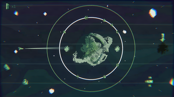

# HUJAM22
# Space Frontier 
Space frontier is a casual arcade game that orginaly maded for HUJAM22. The result of HUJAM'22 is , our game become Overeall #7 and  Compatibility With The Theme #1 among 75 other games by voting. 
In this Arcade  game you traveling in Space! Launch your SpaceShip and  travel among other Planets , Portals and Astreoids.

## How to play 
Goal of this game is to complete the levels by reaching the black holes.There is 9 level and 1 sandbox level.
-  You can click at anywhere to drag you dont need to click it   on spaceship for launch
-  Avoid Planets, Astreoids and  satelites  you can collide with them.
-  Every launch takes 1 fuel and fuel is on top left corner.
-  Portals will teleport you.
-  <strong><del>You can play on MAINMENU.</del></strong>
-  have fun. 

## Controls
-  Only mouse clicking necessary! Drag and Launch the SpaceShip .
-  You can pause by ESC .
-  Yoy can restart level by R.

## Team:
-  Ata Ayyıldız - Developer  
-  Onur Altunışık - Developer 
-  Tolga Varlık - 2D Art
-  Ceren Yöndem - 2D Art

There is no external  Assets used in this game 

## Itch.io 
-  You can downloand or play it  on web from this link : https://satas20.itch.io/space-frontier
-  You can also see our submision ratings and comments : https://itch.io/jam/hujam22/rate/1832142

## Preview
- Gameplay video link : https://www.youtube.com/watch?v=HHih8q1bd_k

  
  
  
  

## Unity Version
- 2021.3.3f1
